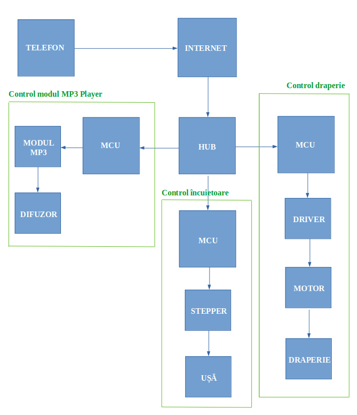
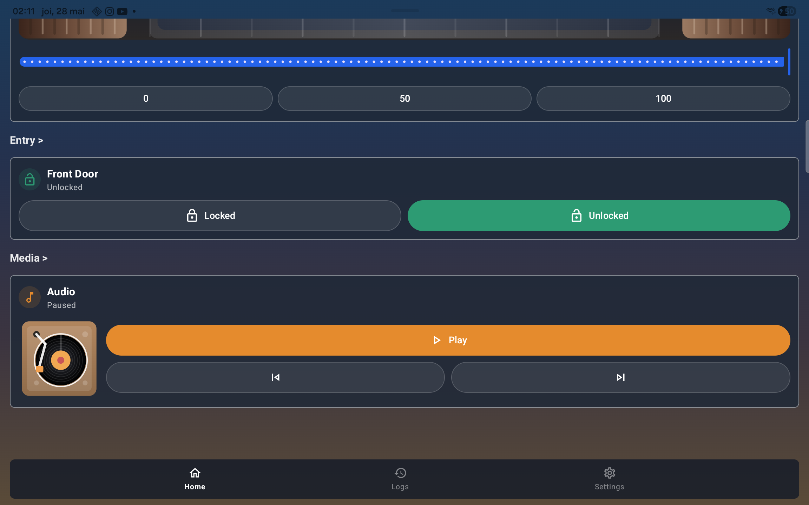
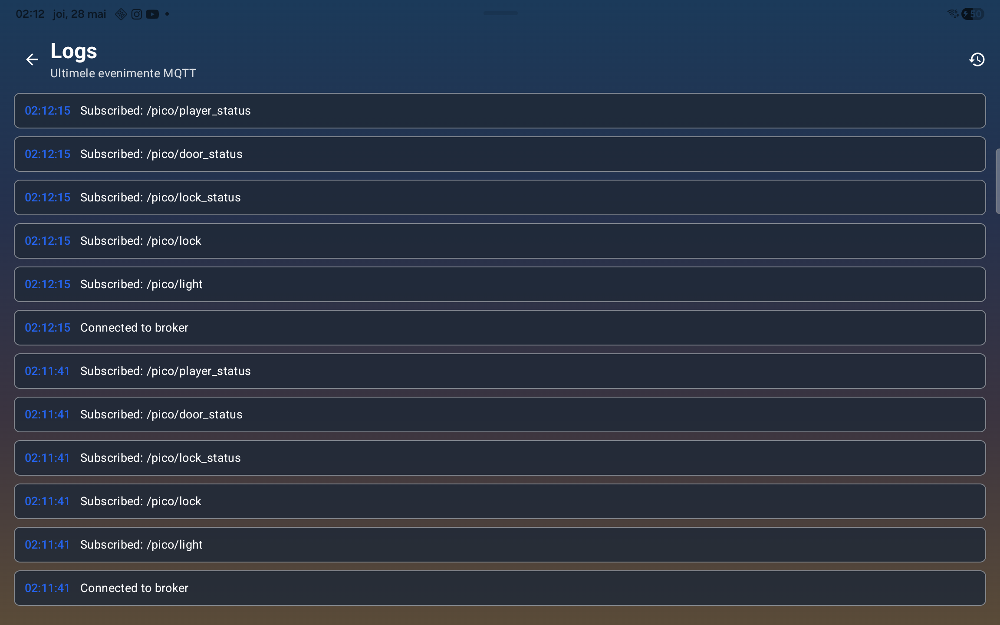
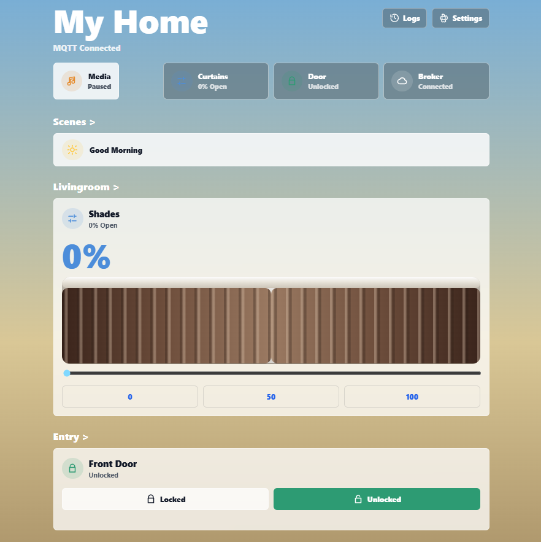
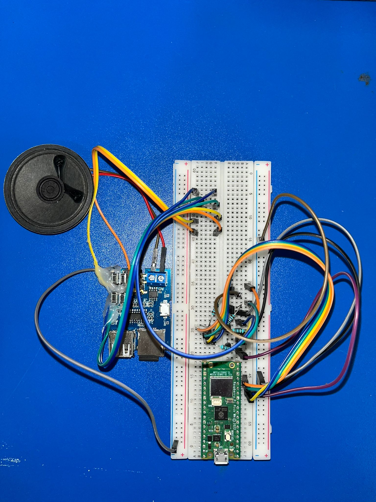
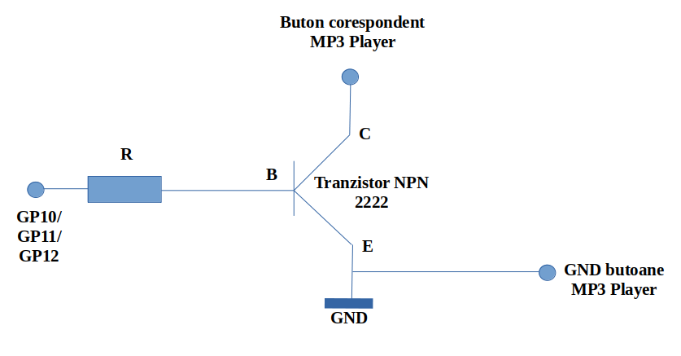
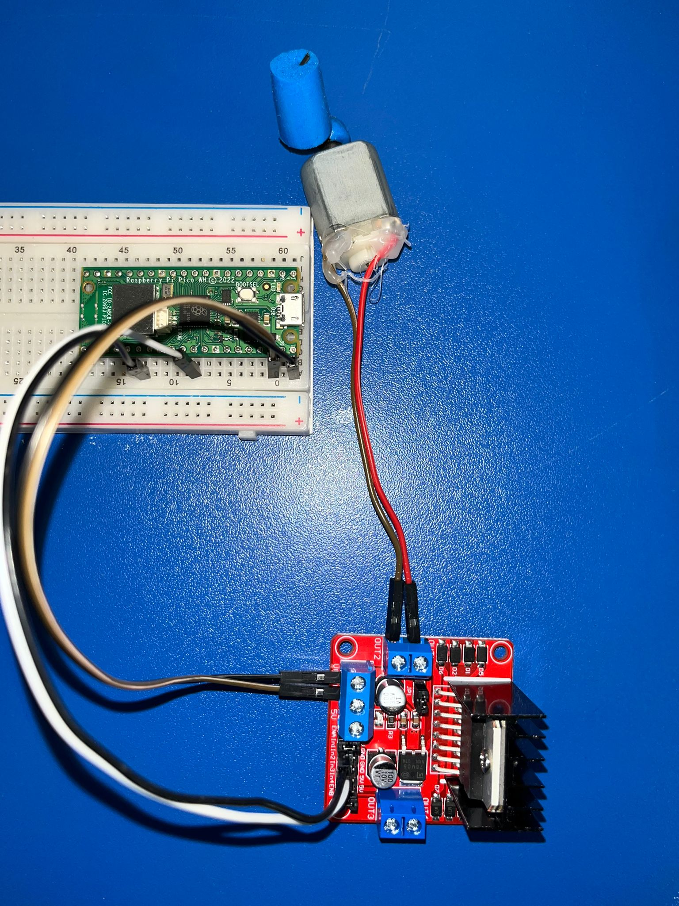
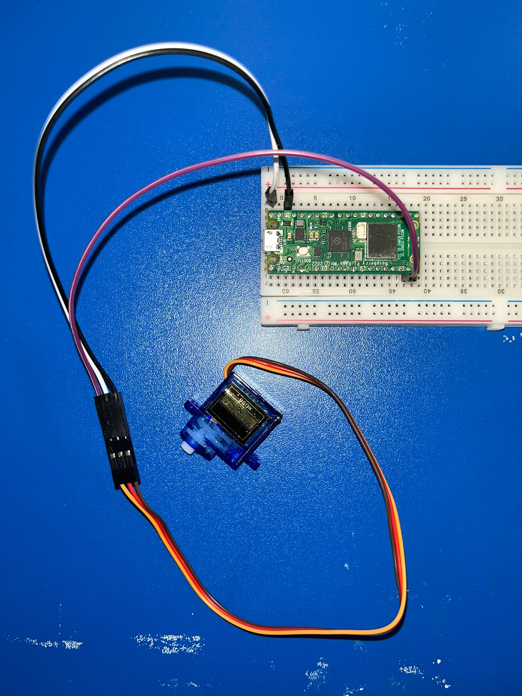

# SmartHome IoT 

### Pandelică Lucian & Săcăluș Andrei - SRIC1

## 1. Prezentare generala

SmartHome IoT este un sistem local pentru controlul unor dispozitive din locuinta prin MQTT. Sistemul include trei module hardware bazate pe Raspberry Pi Pico W/WH, o aplicatie Android si o interfata web. Comunicarea dintre componente se face printr-un broker MQTT Mosquitto rulat pe calculatorul local.

Functionalitatile implementate sunt:

- controlul sistemului audio: play/pause, melodia anterioara, melodia urmatoare;
- controlul draperiei: pozitionare intr-un interval 0-100%;
- controlul incuietorii: lock/unlock;
- sincronizarea starilor intre aplicatia Android, interfata web si dispozitive;
- jurnal de evenimente pentru actiuni si mesaje MQTT.

## 2. Arhitectura sistemului

Diagrama generala a retelei:



Componentele principale sunt:

- **Broker MQTT Mosquitto**: primeste mesajele publicate de aplicatie, serverul web si modulele Pico, apoi le distribuie clientilor abonati.
- **Aplicatia Android**: permite controlul dispozitivelor direct de pe telefon si afiseaza starea curenta.
- **Serverul web Flask**: expune o interfata web pentru aceleasi comenzi si mentine o stare locala sincronizata prin MQTT.
- **Modulul Music**: Pico conectat la modul MP3 Player si difuzor.
- **Modulul Curtain**: Pico conectat la driverul de motor pentru draperie.
- **Modulul Lock**: Pico conectat la servomotorul incuietorii.
- **Grafana**: optional, pentru vizualizarea mesajelor MQTT si a starilor.

Fluxul normal este:

1. Utilizatorul apasa un control in aplicatia Android sau in interfata web.
2. Clientul publica un payload JSON pe topicul MQTT corespunzator.
3. Brokerul Mosquitto distribuie mesajul catre modulul Pico abonat.
4. Modulul Pico actioneaza componenta hardware.
5. Aplicatia si serverul web primesc topicurile de status si actualizeaza interfata.

## 3. Topicuri MQTT

Mesajele sunt transmise in format JSON. Topicurile folosite in proiect sunt definite si in aplicatia Android in `MqttTopics.kt`.

| Topic | Rol | Exemplu payload |
| --- | --- | --- |
| `/pico/music` | comenzi pentru modulul MP3 Player | `{"music_action":"play","music_status":"playing"}` |
| `/pico/player_status` | status audio pentru sincronizare UI | `{"music_status":"paused"}` |
| `/pico/draperie` | pozitia dorita a draperiei | `{"coord":75}` |
| `/pico/lock` | comanda pentru incuietoare | `{"status":"lock"}` |
| `/pico/lock_status` | status incuietoare pentru sincronizare | `{"status":"locked"}` |
| `/pico/door_status` | status contact usa, daca exista senzor | `{"door":"closed"}` |
| `/pico/light` | status lumina, daca este conectat senzorul | `{"light":420,"status":"day"}` |

Pentru muzica, `music_action` poate fi:

- `play`: comuta intre play si pause;
- `next`: trece la melodia urmatoare;
- `prev`: revine la melodia anterioara.

Pentru draperie, `coord` este un numar intre `0` si `100`. Modulul Pico compara coordonata noua cu valoarea precedenta si decide directia motorului.

Pentru incuietoare, `status` poate fi `lock` sau `unlock`.

## 4. Modulul Android

Aplicatia Android este implementata in Kotlin, cu Jetpack Compose pentru interfata. Rolul ei este sa ofere control direct asupra dispozitivelor si sa afiseze starea curenta primita prin MQTT.

Capturi din aplicatie:





Fisiere importante:

- `app/src/main/java/com/example/smarthomeiot/MainActivity.kt`: punctul de intrare al aplicatiei.
- `app/src/main/java/com/example/smarthomeiot/ui/SmartHomeApp.kt`: structura principala a interfetei si navigatia.
- `app/src/main/java/com/example/smarthomeiot/ui/HomeScreen.kt`: ecranul principal cu controalele pentru dispozitive.
- `app/src/main/java/com/example/smarthomeiot/ui/SettingsScreen.kt`: configurarea conexiunii MQTT.
- `app/src/main/java/com/example/smarthomeiot/ui/LogsScreen.kt`: afisarea jurnalului de evenimente.
- `app/src/main/java/com/example/smarthomeiot/viewmodel/SmartHomeViewModel.kt`: logica de stare, comenzi si parsare mesaje MQTT.
- `app/src/main/java/com/example/smarthomeiot/mqtt/MqttManager.kt`: conectare, publicare si abonare MQTT.
- `app/src/main/java/com/example/smarthomeiot/mqtt/MqttTopics.kt`: topicurile folosite de aplicatie.
- `app/src/main/java/com/example/smarthomeiot/data/SettingsRepository.kt`: salvarea setarilor MQTT.

Aplicatia salveaza setarile brokerului MQTT local: host, port, username si parola. La pornire, daca exista setari salvate, incearca reconectarea automata.

Comenzile trimise de aplicatie:

- sliderul draperiei publica pe `/pico/draperie`;
- butoanele lock/unlock publica pe `/pico/lock`;
- controalele audio publica pe `/pico/music` si actualizeaza `/pico/player_status`.

Aplicatia se aboneaza la topicurile de status pentru a actualiza UI-ul in timp real. Pentru exemplul music, daca interfata web trimite `{"music_status":"playing"}` pe `/pico/player_status`, aplicatia actualizeaza starea playerului fara refresh manual.

Build local:

```powershell
.\gradlew.bat :app:assembleDebug
```

Instalare pe telefon prin ADB, dupa build:

```powershell
adb install -r app\build\outputs\apk\debug\app-debug.apk
```

## 5. Modulul Web

Modulul web este o aplicatie Flask aflata in:

```text
app/src/main/java/com/example/smarthomeiot/website/server.py
```

Interfata web:



Serverul web are trei roluri:

- afiseaza controale pentru music, curtain si lock;
- publica mesaje MQTT cand utilizatorul trimite comenzi;
- asculta topicurile de status si actualizeaza starea locala expusa prin API.

Rute principale:

| Ruta | Rol |
| --- | --- |
| `/` | ecranul principal web |
| `/api/action` | primeste actiuni din frontend si publica MQTT |
| `/api/state` | returneaza starea curenta pentru sincronizare live |
| `/settings` | setari broker MQTT |
| `/logs` | jurnal de evenimente |

Serverul publica pe:

- `/pico/music`
- `/pico/player_status`
- `/pico/draperie`
- `/pico/lock`

Serverul se aboneaza la:

- `/pico/player_status`
- `/pico/music`
- `/pico/lock`
- `/pico/lock_status`

Frontendul web citeste periodic `/api/state`, astfel incat modificarile facute din aplicatia Android pot aparea si in web, daca sunt publicate pe topicurile de status.

Rulare directa pe Windows folosind venv-ul din directorul `website`:

```powershell
cd E:\AndroidStudioProjects\SmartHomeIoT\app\src\main\java\com\example\smarthomeiot\website
.\.venv-win\Scripts\python.exe server.py
```

Adrese uzuale:

- local: `http://127.0.0.1:5000/`
- din reteaua locala: `http://IP_LAPTOP:5000/`

Pentru configurarea prin variabile de mediu:

```powershell
$env:MQTT_HOST="IP_LAPTOP"
$env:MQTT_PORT="1884"
$env:MQTT_USERNAME="web"
$env:MQTT_PASSWORD="PAROLA_WEB"
.\.venv-win\Scripts\python.exe server.py
```

## 6. Modulele MicroPython

Fiecare modul Pico are acelasi model de lucru:

1. se conecteaza la reteaua Wi-Fi;
2. se conecteaza la brokerul MQTT;
3. se aboneaza la topicul sau;
4. primeste payload JSON;
5. actioneaza pinii hardware corespunzatori.

Fiecare director contine:

- `main.py`: programul incarcat pe Pico;
- `config.py` sau `config.example.py`: date de configurare;
- `umqtt/simple.py`: client MQTT pentru MicroPython.

Incarcare cod pe Pico cu `mpremote`:

```powershell
cd E:\AndroidStudioProjects\SmartHomeIoT\app\src\main\java\com\example\smarthomeiot\lock
py -3 -m mpremote connect COM17 fs mkdir :umqtt
py -3 -m mpremote connect COM17 fs cp main.py :main.py
py -3 -m mpremote connect COM17 fs cp umqtt\simple.py :umqtt/simple.py
py -3 -m mpremote connect COM17 reset
```

Portul `COM17` se schimba in functie de placuta conectata.

### 6.1 Music

Fisier:

```text
app/src/main/java/com/example/smarthomeiot/music/main.py
```

Hardware:



Schema de legare pentru modulul MP3 Player:



Modulul Music primeste comenzi pe `/pico/music`. In functie de `music_action`, Pico activeaza unul dintre pinii conectati la butoanele modulului MP3 Player:

- `play`
- `next`
- `prev`

Pentru modulul MP3 Player folosit in proiect, Pico nu reda direct fisier audio prin PWM. Pico actioneaza electronic butoanele modulului MP3, iar redarea propriu-zisa este facuta de modulul MP3 Player. Fisierul audio se afla pe suportul acceptat de acel modul, de obicei card SD sau memorie USB, in functie de model.

### 6.2 Curtain

Fisier:

```text
app/src/main/java/com/example/smarthomeiot/curtain/main.py
```

Hardware:



Conexiuni:

- `VBUS Pico` la `VCC Driver`;
- `GND Pico` la `GND Driver`;
- `GP20 Pico` la `In1 Driver`;
- `GP26 Pico` la `In2 Driver`;
- `Out1` si `Out2` la motor.

Modulul Curtain primeste pe `/pico/draperie` un payload cu `coord`. Valoarea este comparata cu pozitia anterioara:

- daca valoarea creste, motorul este actionat intr-un sens;
- daca valoarea scade, motorul este actionat in sensul opus;
- daca valoarea este identica, motorul nu este actionat.

### 6.3 Lock

Fisier:

```text
app/src/main/java/com/example/smarthomeiot/lock/main.py
```

Hardware:



Conexiuni:

- `VBUS Pico` la alimentarea servomotorului;
- `GND Pico` la `GND` servomotor;
- `GP14 Pico` la pinul PWM al servomotorului.

Modulul Lock primeste comenzi pe `/pico/lock`:

- `{"status":"lock"}`: servomotorul se pozitioneaza pentru inchidere;
- `{"status":"unlock"}`: servomotorul se pozitioneaza pentru deschidere.

Dupa actionare, modulul poate publica starea pe `/pico/lock_status`, astfel incat aplicatia Android si web-ul sa ramana sincronizate.

## 7. Broker MQTT

Brokerul folosit este Mosquitto. In configuratia locala curenta, brokerul ruleaza pe calculator si asculta pe IP-ul laptopului. Portul poate fi `1883` sau `1884`, in functie de configuratia disponibila local.

Exemplu de configuratie Mosquitto:

```conf
listener 1884 0.0.0.0
allow_anonymous false
password_file E:\AndroidStudioProjects\SmartHomeIoT\mqtt\passwd.win
```

Pornire pe Windows:

```powershell
& "C:\Program Files\Mosquitto\mosquitto.exe" -c "E:\AndroidStudioProjects\SmartHomeIoT\mqtt\mosquitto.remote.conf" -v
```

Test publicare:

```powershell
& "C:\Program Files\Mosquitto\mosquitto_pub.exe" -h IP_LAPTOP -p 1884 -u web -P PAROLA_WEB -t /pico/player_status -m "{`"music_status`":`"playing`"}"
```

Test ascultare:

```powershell
& "C:\Program Files\Mosquitto\mosquitto_sub.exe" -h IP_LAPTOP -p 1884 -u web -P PAROLA_WEB -t /pico/# -v
```

Utilizatori recomandati:

- `web`: pentru serverul Flask;
- `mobile`: pentru aplicatia Android;
- `music`: pentru modulul MP3 Player;
- `curtain`: pentru modulul draperiei;
- `lock`: pentru modulul incuietorii;
- `grafana`: pentru dashboard, daca este folosit.

## 8. Rulare completa

Ordinea recomandata de pornire:

1. Porneste brokerul MQTT.
2. Verifica IP-ul laptopului in reteaua Wi-Fi folosita de placute.
3. Porneste serverul web Flask.
4. Alimenteaza placutele Pico.
5. Deschide aplicatia Android si configureaza brokerul MQTT.
6. Deschide interfata web si verifica daca actiunile apar si in aplicatie.

Verificari rapide:

```powershell
Get-NetTCPConnection -LocalPort 1884 -State Listen
Get-NetTCPConnection -LocalPort 5000 -State Listen
```

Pentru Pico, logurile trebuie sa arate:

```text
Connected to Wi-Fi: (...)
Connected to MQTT Broker
Subscribed to topic: ...
```

## 10. Probleme frecvente

### Pico ramane la `Connecting to Wi-Fi...`

Verifica:

- SSID-ul si parola din `main.py` sau `config.py`;
- daca hotspotul/routerul este pornit;
- daca Pico este in raza retelei;
- daca reteaua este pe 2.4 GHz, nu doar 5 GHz;
- daca ai incarcat fisierul corect pe placuta potrivita.

### `MQTTException: 5`

Codul `5` inseamna autentificare refuzata de broker. Verifica:

- username-ul si parola din codul Pico;
- parola din fisierul Mosquitto `passwd`;
- daca brokerul a fost repornit dupa modificarea parolei;
- daca dispozitivul se conecteaza la portul corect.

### `ECONNABORTED` la conectarea MQTT

Verifica:

- daca brokerul ruleaza;
- daca IP-ul brokerului este IP-ul laptopului din aceeasi retea cu Pico;
- daca firewall-ul permite portul MQTT;
- daca folosesti portul corect, de exemplu `1884` in configuratia locala.

### Music primeste mesaje, dar nu actioneaza

Verifica:

- daca modulul MP3 Player are alimentare;
- daca difuzorul este conectat la modulul MP3 Player;
- daca exista fisier audio pe suportul modulului MP3;
- daca pinii Pico corespund firelor legate la butoanele `play`, `next`, `prev`;
- daca semnalul este activ-high sau activ-low, in functie de montaj.

### Web si Android nu se sincronizeaza

Verifica:

- daca ambele folosesc acelasi broker MQTT;
- daca ambele folosesc acelasi port;
- daca aplicatia Android este reconstruita dupa modificari;
- daca statusul audio se publica pe `/pico/player_status`;
- daca statusul lock se publica pe `/pico/lock_status` sau cel putin pe `/pico/lock`.

### Portul serial este ocupat

Inchide sesiunea `mpremote` activa cu:

```text
Ctrl + ]
```

Sau inchide terminalul care tine portul COM deschis, apoi ruleaza din nou comenzile `mpremote`.

## 11. Structura relevanta a proiectului

```text
app/src/main/java/com/example/smarthomeiot/
├── MainActivity.kt
├── data/
├── model/
├── mqtt/
├── ui/
├── viewmodel/
├── website/
│   ├── server.py
│   └── templates/
├── music/
│   ├── main.py
│   └── umqtt/simple.py
├── curtain/
│   ├── main.py
│   └── umqtt/simple.py
├── lock/
│   ├── main.py
│   └── umqtt/simple.py
└── imgs/
```

## 12. Bibliografie si resurse

- https://mosquitto.org/
- https://flask.palletsprojects.com/
- https://www.eclipse.org/paho/
- https://docs.micropython.org/
- https://developer.android.com/jetpack/compose
