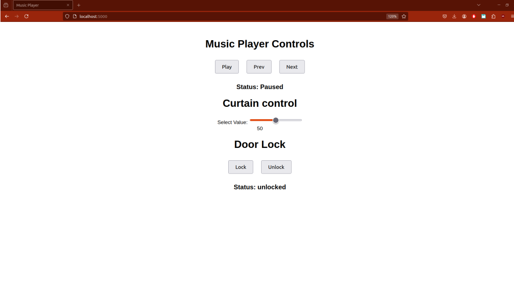
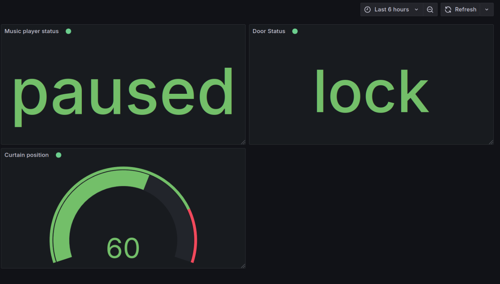
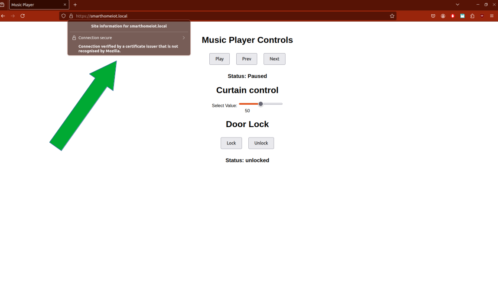

# 1. Introducere

Pentru fiecare dintre noi, casa în care locuim este un loc special. E locul unde ne petrecem majoritatea timpului liber, unde dormim, unde ne bucurăm de momentele plăcute cu familia. Vine astfel nevoia de a face din casa noastră un loc cât mai confortabil. Dar și de a o menține în sigurață, ca orice lucru important pentru noi.

Într-o eră a vitezei, în care timpul liber e din ce în ce mai puțin și uităm lucruri din cauza stresului de zi cu zi, a apărut nevoia controlului și monitorizării casei de la distanță. Fie că am uitat dacă am încuiat ușile și nu vrem să ne întoarcem până acasă să verificăm, fie că dorim să controlăm aspecte precum temperatura din casă asfel încât să creăm un ambient potrivit înainte să ajungem acasă, dar să economisim energie în timpul în care suntem plecați, toate sunt exemple de aplicații extrem de utile ale controlului la distanță a casei. Odată cu popularizarea tehnologiilor IoT, acestea au permis ca ideile de mai sus să devină realitate, apărând ideea de SmartHome. 

Scopul proiectului este demonstrarea unor aplicații simple de control la distanță obiectelor prezente în casa noastră, anume:
- controlul draperiilor
- controlul ușilor (închis / deschis)
- controlul sistemului audio

Felul în care vom realiza aceste automatizări este detaliat în secțiunea următoare.

## 1.1. Automatizări

### 1.1.1 Controlul draperiilor

Prin controlul draperiilor de la distanță, putem ajuta la păstrarea unei temperaturi / a unei cantități de lumină optime în locuința noastră. Spre exemplu, pe timpul zilelor călduroase de vară putem dori să blocăm razele soarelui pentru a nu crește și mai mult temperatura în casă, dar să permitem pentru un anumit timp plantelor din casă să ia aportul necesar de lumină.

### 1.1.2 Controlul ușilor

Prin controlul ușilor, ne putem asigura că am încuiat când am plecăm de acasă (iar dacă am uitat să nu fie nevoie să ne întoarcem), putem permite accesul unei persoane dacă este nevoie (fără ca aceasta să obțină cheia), iar, de asemenea, putem verifica ușile înainte de culcare mai ușor, dacă avem o locuință cu suprafață mare, iar distanța de la dormitor până la intrare este semnificativă.

### 1.1.3 Controlul sistemului audio

Prin controlul sistemului audio, pregătim un ambient plăcut înainte să ajungem acasă, dar controlăm de asemenea cu ușurință atunci când suntem acasă, dar ne petrecem timpul în altă cameră decât cea în care se află sistemul audio.

## 1.2 Componente folosite

    1. Raspberry Pi Pico WH x 3
    2. Modul MP3 Player
    3. Speaker
    4. Driver motor
    5. Motor
    6. Stepper

# 2. Arhitectura

## 2.1 Diagrama topologiei rețelei

## 2.2 Descrierea componentelor

Am decis să folosesc pentru comunicarea între componente protocolul MQTT, datorită modelului publish-subscribe ce se potrivește nevoilor proiectului, dar și ușurinței de utilizare, lucrând cu acesta și în cadrul laboratoarelor.

Voi detalia pe larg topic-urile folosite și structura mesajelor, în secțiunea 2.3 Protocoalele de comunicație utilizate.

Pentru moment, vom parcurge în cele ce urmează componentele topologiei.

### 2.2.1 Hub

Pentru Hub, vom folosi un sistem local (computer pe care rulează Linux), ce va rula următoarele servicii:
- Broker MQTT
- Grafana
- Server cu pagină web

Prin intermediul interfeței web a serverului vom controla sistemul nostru. Aceasta va conține:
- 3 butoane pentru MP3 Player (Play, Prev, Next)
- status pentru MP3 Player
- slider pentru modificarea poziției draperiei
- coordonata curentă a draperiei (ce s-a selectat pe slider)
- 2 butoane pentru controlul ușii (Lock, Unlock)
- status pentru ușă

Serverul va publica mesaje MQTT pe diferite topic-uri, în funcție de acțiunile utilizatorului pe pagină. Acestea vor ajunge la brokerul MQTT rulat de asemenea local, care le va distribui către cele trei componente de control (abonate la topicul de interes).

Instanța Grafana va fi abonată la toate topic-urile din rețea, va primi datele de la server prin intermediul brokerului MQTT și se va ocupa de procesarea și vizualizarea acestora, oferind utilizatorului grafice utile pentru înțelegerea statusului.

### 2.2.2 Controlul draperiilor

- controller (Raspberry Pi Pico)
- driver
- motor

Controller-ul primește comenzile de la Hub și activează semnale pe fire legate la driver, în funcție de sensul de rotație pentru motor (sensul de deplasare a draperiei).

### 2.2.3  Controlul sistemului audio

- controller (Raspberry Pi Pico)
- modul MP3 Player
- difuzor

Controller-ul primește comenzile de la Hub și activează semnale pe fire legate la butoanele modulului MP3 Player, pentru a controla sistemul audio. Difuzorul este legat la sistem pentru a reda melodiile.

### 2.2.4 Controlul ușilor

- controller (Raspberry Pi Pico)
- stepper

Controller-ul primește comenzi de la Hub și activează semnale pe fire legate la stepper pentru a închide / deschide ușa. Stepper-ul acționează încuietoarea ușii și se poziționează la 0 (deschis), respectiv 90 de grade (închis).

## 2.3 Protocoalele de comunicație utilizate

După cum s-a mentionat mai sus, am folosit în cadrul topologiei protocolul MQTT. Am creat trei topic-uri, câte unul pentru fiecare componentă de control, după cum urmează:
- /pico/music pentru MP3 Player
- /pico/draperie pentru draperie
- /pico/lock pentru încuietoarea ușii

Pentru conținutul mesajelor transmise, am folosit payload-uri JSON, cu structură diferită în funcție de topic. Mai jos prezentăm conținutul mesajelor după executarea de către utilizator a tuturor acțiunilor posibile în cadrul interfeței web.

### 2.3.1 Topicul /pico/music

Mesajele de pe acest topic au următoarea structură:

    {
    “music_action” : “play” / “next” / “prev”
    “music_status” : “playing” / “paused”
    }

La apăsarea butonului Play atunci când statusul curent este paused, serverul trimite următorul mesaj:

    { “music_action” : “play”, “music_status” : “playing” }

Atunci când statusul curent este “playing”, modificăm statusul:

    { “music_action” : “play”, “music_status” : “paused” }

La apăsarea butonului Next, serverul trimite următorul mesaj:

    { “music_action” : “next”, “music_status” : “playing” }

La apăsarea butonului Prev, serverul trimite următorul mesaj:

    { “music_action” : “prev”, “music_status” : “playing” }

### 2.3.2 Topicul /pico/draperie

Mesajele de pe acest topic au urătoarea structură:

    {
    “coord” : x
    }

unde x reprezintă un număr intreg din intervalul [0,100], anume deschiderea dorită pentru draperie, după cum a fost selectată folosind slider-ul din pagina web. Acest mesaj se trimite de fiecare dată când se modifică poziția slider-ului în cadrul paginii.

### 2.3.3 Topicul /pico/lock

Mesajele de pe acest topic au urătoarea structură:

    {
    “status” : “lock” / “unlock”
    }

Serverul menține intern statusul curent (lock / unlock) și publică mesaje MQTT pe topic doar dacă acțiunea indicată de apăsarea butonului modifică statusul curent (practic, spre exemplu, dacă apăsăm de două ori la rând butonul Lock, nu se trimit două mesaje, ci cel mult unul – dacă statusul era unlock înaintea primei apăsări a butonului).

La apăsarea butonului Lock (dacă are sens trimiterea mesajului), serverul trimite:

    { “status” : “lock” }

La apăsarea butonului Unlock (dacă are sens trimiterea mesajului), serverul trimite:

    { “status” : “unlock” }

# 3. Implementare

## 3.1 Pașii de configurare

Această secțiune descrie modul de configurare a componentelor harware / software folosite, pas cu pas.

### 3.1.1 Hardware

#### 3.1.1.1 Hub

Întrucât am rulat local Hub-ul, nu au fost necesare configurări hardware.

#### 3.1.1.2 Controlul MP3 Player-ului

Am ales următoarele componente:
- Raspberry Pi Pico WH
- Modul MP3 Player cu Amplificator de 2 W Integrat
- Difuzor de 1 W
Pe lângă acestea, am avut nevoie și de componente și materiale auxiliare:
- Rezistor 1K x 3
- Tranzistor x 4

Le-am conectat astfel:

Pentru siguranță la transport am folosit un mini-pistol cu Hot Glue pentru a asigura mai bine lipiturile destul de firave dintre componente, datorate spațiului restrâns de pe MP3 Player care a îngreunat lipirea.

Mai jos este prezentată o fotografie cu modulul rezultat:

#### 3.1.1.3 Controlul draperiei

Am ales următoarele componente:
- Raspberry Pi Pico WH
- Modul cu Driver de Motoare Dual L298N
- Motor în Miniatură 3-6 V

Le-am conectat astfel:
- VBUS Pico – VCC Driver
- GND Pico – GND Driver
- GP20 Pico – In1 Driver
- GP26 Pico – In2 Driver
- Out1 & Out2 Driver – Motor

Pentru siguranță la transport am folosit din nou mini-pistolul cu Hot Glue pentru a asigura mai bine lipiturile de pe motor.

Mai jos este prezentată o fotografie cu modulul rezultat:

##### 3.1.1.4 Controlul încuietorii ușii

Am ales următoarele componente:
- Raspberry Pi Pico WH
- Micro Servomotor SG90 180°

Le-am conectat astfel:
- VBUS Pico – VCC Stepper
- GND Pico – GND Stepper
- GP14 Pico – PWM Stepper

Mai jos este prezentată o fotografie cu modulul rezultat:

### 3.1.2 Software

#### 3.1.2.1 Hub

Pentru broker-ul MQTT am folosit Mosquitto, fiind familiar cu felul în care se configurează (din cadrul laboratorului). De asemenea, am ales să folosesc utilizatori cu parolă pentru fiecare entitate din sistem.

Am configurat broker-ul folosind următoarele comenzi:

sudo apt install mosquitto
sudo ufw allow 1883 
touch /etc/mosquitto/conf.d/mosquitto.conf
touch `/etc/mosquitto/passwd`
chown root `/etc/mosquitto/passwd`
chmod 700 `/etc/mosquitto/passwd`
sudo mosquitto_passwd /etc/mosquitto/passwd $USERNAME # for each user
sudo setfacl -m u:mosquitto:r /etc/mosquitto/passwd # allow mosquitto to read it

De asemenea, am adăugat următoarele linii la finalul fișierului mosquitto.conf:

listener 1883 0.0.0.0
password_file /etc/mosquitto/passwd

Pentru Server am folosit un program Python ce folosește biblioteca Flask, împreună cu o pagină HTML ce poate fi accesată din browser la adresa localhost:5000. Pagina web este prezentată mai jos:

La fiecare interacțiune cu această interfață se trimite un HTTP Post cu un formular ce conține informația necesară interpretării operației efectuate (fie numele butonului, fie coordonata slider-ului).

În cadrului serverului Flask, se apelează metodele corespunzătoare în funcție de conținutul formularului submis. Aceste metode publică câte un mesaj pe topicul corespunzător, mesaj ce va ajunge la MQTT Broker, iar apoi la clienții abonați la topic.

#### 3.1.2.2 Controlul MP3 Player-ului

Bibliotecă necesară: umqtt
Pe plăcuță am încărcat folderul umqtt ce conține fișierul simple.py, împreună cu fișierul main.py ce conține programul rulat pe plăcuță.

Programul de pe plăcuță rulează un client MQTT abonat la topicul “/pico/music”, primește mesajele de pe acest topic de la MQTT Broker. În funcție de conținutul acestora, apelează funcții corespunzătoare celor trei operații suportate, care activează diferiți pini pe plăcuță pentru a transmite semnale către MP3 Player.

#### 3.1.2.3 Controlul draperiei

Bibliotecă necesară: umqtt
Pe plăcuță am încărcat folderul umqtt ce conține fișierul simple.py, împreună cu fișierul main.py ce conține programul rulat pe plăcuță.

Programul de pe plăcuță rulează un client MQTT abonat la topicul “/pico/draperie”, primește mesajele de pe acest topic de la MQTT Broker. În funcție de conținutul acestora, apelează funcții corespunzătoare celor două operații de control a motorului: forward și backward (ținând cont de rezultatul comparației dintre coordonata anterioară și cea curentă.

#### 3.1.2.3 Controlul încuietorii ușii

Bibliotecă necesară: umqtt
Pe plăcuță am încărcat folderul umqtt ce conține fișierul simple.py, împreună cu fișierul main.py ce conține programul rulat pe plăcuță.

Programul de pe plăcuță rulează un client MQTT abonat la topicul “/pico/lock”, primește mesajele de pe acest topic de la MQTT Broker. În funcție de conținutul acestora, apelează funcții corespunzătoare celor două operații suportate: lock și unlock. Acestea transmit semnale către stepper, prin pin-ul configurat PWM.

## 3.2 Modul de funcționare

1. Pornim brokerul MQTT (mosquitto) folosind comanda:

    sudo mosquitto -v -c "/etc/mosquitto/conf.d/mosquitto.conf"

2. Pornim Grafana folosind comanda:

    sudo systemctl start grafana-server

3. Pornim serverul folosind comanda:

    python3.10 server.py

în cadrul venv-ului configurat.

4. Alimentăm cele trei plăcuțe la 5V (având programele denumite main.py, vor porni automat). Fiecare plăcuță rulează cod prin care se conectează la rețeaua Wi-Fi (în cazul meu hotspot-ul de la telefonul mobil, la care este conectat și laptop-ul) care se abonează la topicul de interes prin intermediul broker-ului MQTT.

5. Dăm comenzi în cadrul interfeței web și urmărim efectele:) 
4. Vizualizare și procesare de date

Am folosit Grafana, deoarece este o soluție open-source ce are suport de prelucrare și vizualizare pentru multe protocoale, inclusiv MQTT. Un aspect important de asemenea a fost multitudinea de resurse prezente pe internet pentru configurarea Grafana. Voi parcurge în cele ce urmează pașii efectuați.

## 4.1 Configurare

Am configurat Grafana folosind următoarele comenzi:

    sudo apt-get install -y apt-transport-https software-properties-common wget
    sudo mkdir -p /etc/apt/keyrings/

    wget -q -O - https://apt.grafana.com/gpg.key | gpg --dearmor | sudo tee /etc/apt/keyrings/grafana.gpg > /dev/null

    echo "deb [signed-by=/etc/apt/keyrings/grafana.gpg] https://apt.grafana.com stable main" | sudo tee -a /etc/apt/sources.list.d/grafana.list

    echo "deb [signed-by=/etc/apt/keyrings/grafana.gpg] https://apt.grafana.com beta main" | sudo tee -a /etc/apt/sources.list.d/grafana.list

    sudo apt-get update

    sudo apt-get install grafana

În cadrul Grafana, care se accesează local, prin browser, la adresa localhost:3000, am instalat plugin-ul pentru mesaje MQTT, căruia i-am transmis adresa la care rulează brokerul MQTT (127.0.0.1), împreună cu portul (1883).

Am creat apoi un Dashboard. Utilizatorul grafana (configurat în cadrul brokerului MQTT special pentru Grafana) dă SUBSCRIBE la toate topic-urile mesajelor schimbate în cadrul sistemului.

Pentru fiecare topic am creat un grafic în cadrul Dashboard-ului. 

## 4.2 Prelucrare

Am selectat pentru fiecare grafic / topic câmpul de interes din payload-ul JSON, astfel:
    • pentru modulul MP3 Player: music_status
    • pentru modulul draperiei: coord
    • pentru modulul încuietorii: status

Ulterior, am ales modalitatea de afișare pentru fiecare, optând în cazul modulului MP3 Player și cel al încuietorii pentru optiunea Stat, iar în cazul draperiei pentru optiunea Gauge.

## 4.3 Vizualizare

Este afișată starea curentă pentru ușă (locked / unlocked), poziția draperiei (într-un interval [0-100], 0 reprezentând complet deschisă, iar 100 că fereastra este complet acoperită de draperie), împreună cu starea curentă a MP3 Player-ului (playing / paused).

# 5. Securitate

Deoarece serverul rulează local, am folosit nginx pentru a crea un domeniu care să refere la localhost, pentru a obține o adresă pentru care să aibă sens folosirea unui certificat în browser.

Așadar, pentru început, am realizat instalarea și configurarea nginx folosind următoarele comenzi:

Instalare și pornire serviciu:
    sudo apt install nginx
    sudo nginx -t
    sudo systemctl start nginx

Modificarea conținutului fișierului de configurare nginx:
    sudo vim /etc/nginx/nginx.conf

Am adăugat următorul conținut în cadrul blocului http {}:
    server {
        listen 443 ssl;
        server_name smarthomeiot.local;  # Your custom domain

        # Specify paths to your PEM certificate and private key
        ssl_certificate /home/lucian/iot_certificates/cert/CA/smarthomeiot.local.crt;  # Your certificate in .pem format
        ssl_certificate_key /home/lucian/iot_certificates/cert/CA/smarthomeiot.local.key;  # Your private key in .pem format

        # SSL settings for security
        ssl_protocols TLSv1.2 TLSv1.3;
        ssl_ciphers 'ECDHE-ECDSA-AES128-GCM-SHA256:ECDHE-RSA-AES128-GCM-SHA256';
        ssl_prefer_server_ciphers on;

        # Proxy settings to forward traffic to your Flask server
        location / {
                    proxy_pass https://127.0.0.1:5000;  # Forward to Flask app
                    proxy_set_header Host $host;
                    proxy_set_header X-Real-IP $remote_addr;
                    proxy_set_header X-Forwarded-For $proxy_add_x_forwarded_for;
                    proxy_set_header X-Forwarded-Proto $scheme;
        }

        # Optionally, add error pages
        error_page 404 /404.html;
    }

Repornirea serviciului:

    sudo systemctl reload nginx

Apoi, am adăugat smarthomeiot.local la fișierul /etc/hosts, cu referință la adresa 127.0.0.1.

Ulterior, am creat cerificatele folosind următoarele comenzi:

    mkdir -p ./cert/CA
    openssl genrsa -out ./cert/CA/rootCA.key 4096
    openssl req -new -x509 -days 365 -key ./cert/CA/rootCA.key -subj="/C=RO/ST=Bucharest/O=Poli/CN=Poli CA" -out ./cert/CA/rootCA.crt
    openssl req -newkey rsa:2048 -nodes -keyout ./cert/CA/smarthomeiot.local.key -subj="/C=RO/ST=Bucharest/O=Poli/CN=*.smarthomeiot.local" -out 
    ./cert/CA/smarthomeiot.local.csr
    openssl x509 -req -extfile <(printf "subjectAltName=DNS:smarthomeiot.local,DNS:*.smarthomeiot.local") -days 365 -in ./cert/CA/smarthomeiot.local.csr -CA ./cert/CA/rootCA.crt -CAkey ./cert/CA/rootCA.key -CAcreateserial -out ./cert/CA/smarthomeiot.local.crt

Apoi, am modificat modalitatea de rulare a aplicației din spatele site-ului web:

    app.run(debug=True, ssl_context=("/home/lucian/iot_certificates/cert/CA/smarthomeiot.local.crt", "/home/lucian/iot_certificates/cert/CA/smarthomeiot.local.key"))

Ultimul pas a fost adăugarea root.crt în browser-ul folosit (Firefox în cazul meu).

# 6. Provocări și soluții

## Structura mesajelor

Inițial, am ales să trimit drept conținut pentru mesaje string-uri simple cu un nume sugestiv pentru butonul apăsat în interfața web (ex: “play”, “prev” etc.), iar în cazul slider-ului pentru deschiderea draperiei am trimis mesaje de forma: “forward10”, “backward15” - în funcție de sensul de deplasare față de coordonata anterioară (lucru decis de către server).
Ulterior, atunci când am ajuns la partea de vizualizare a datelor, anume configurarea Dashboard-ului Grafana, nu am reușit să vizualizez mesajele din cauza formei lor nestructurate.
Așadar, am schimbat forma către un payload JSON, acceptat de plug-in-ul MQTT folosit. În cazul mesajelor de pe topic-ul draperiei, am decis să simplific, iar în momentul de față serverul nu mai ia decizii față de direcția de deplasare a motorului (forward / backward), ci doar trimite coordonata actuală a slider-ului, direcția de deplasare a motorului fiind decisă de programul rulat pe Raspberry Pi, comparându-se coordonata primită anterior.

## Modulul MP3 Player

În cazul modulului MP3 Player, am optat inițial pentru folosirea unui radio auto, acesta având un amplificator integrat și modele pe piață cu Bluetooth și telecomandă. M-am gândit să copiez codurile emise de telecomandă, pe care să le trimită Raspberry Pi către acesta la apăsarea butoanelor în interfața web de către utilizator.
Am renunțat la idee și am optat pentru un modul MP3 Player simplu, din cauza costului ridicat și al alimentării la tensiune mai mare decât puteam produce (era necesară o sursă de alimentare suplimentară).
Modulul MP3 Player găsit pe piață mi-a oferit și posibilitatea trimiterii semnalelor de Play / Prev etc prin legături cu fire, lucru mai simplu decât copierea codurilor de pe telecomandă dorită inițial.

## Lipirea firelor pe modulul MP3 Player

Modulul MP3 Player găsit pe piață are 4 butoane pentru gestionarea melodiilor. Pentru a muta controlul la Raspberry Pi, am legat fire de la plăcuță la butoane. Dar, butoanele de pe modul sunt foarte mici și extrem de apropiate, fapt ce a îngreunat lipirea firelor și a creat legături slabe ce s-au rupt la transport.
A fost nevoie de mai multe sesiuni de lipire a acestor fire, iar la final am optat pentru folosirea unui pistol cu Hot Glue, pentru a securiza mai bine legăturile și a le oferi rezistență sporită.

## Configurarea Grafana

Am întâlnit dificultăți în prelucrarea și vizualizarea datelor în cadrul dashboard-ului Grafana, opțiunile prezentate fiind numeroase. Mi-a fost greu să identific setările de care aveam nevoie, dar am urmărit tutoriale care m-au ajutat în acest sens.

# 7. Bibliografie

- https://ocw.cs.pub.ro/courses/priot/laboratoare/04
- https://ocw.cs.pub.ro/courses/priot/laboratoare/05
- https://ocw.cs.pub.ro/courses/priot/laboratoare/06
- https://ocw.cs.pub.ro/courses/priot/laboratoare/08
- https://mosquitto.org/
- https://medium.com/gravio-edge-iot-platform/how-to-set-up-a-mosquitto-mqtt-broker-securely-using-client-certificates-82b2aaaef9c8- 
- https://grafana.com/docs/grafana/latest/setup-grafana/installation/debian/#install-from-apt-repository
- https://www.educba.com/flask-https/
- https://blog.miguelgrinberg.com/post/running-your-flask-application-over-https
- https://core.telegram.org/bots/features
- https://makeblock-micropython-api.readthedocs.io/en/latest/public_library/Third-party-libraries/urequests.html
- https://grafana.com/docs/grafana/latest/setup-grafana/configure-grafana/
- https://grafana.com/docs/grafana/latest/setup-grafana/
- https://medium.com/activewizards-machine-learning-company/intro-to-grafana-installation-configuration-and-building-the-first-dashboard-bf408747e6a8
- https://grafana.com/docs/grafana/latest/setup-grafana/set-up-https/https://grafana.com/docs/grafana/latest/setup-grafana/set-up-https/
